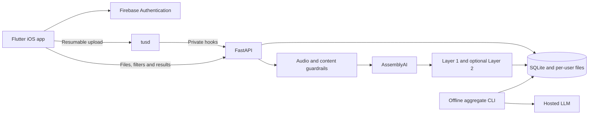

# Voice Analytics Agentic AI Platform

Working POC that authenticates users, accepts resumable audio uploads, transcribes speech, runs layered analysis, stores per-user results, and presents them in a Flutter iOS app.

## Implemented scope

- Firebase email/password signup and login.
- Single and multiple resumable TUS uploads with independent progress and retry.
- Per-user audio, transcript, Layer 1, and optional Layer 2 results.
- Layer 1 duration, summary, professional topics, personal topics, and upcoming events.
- Layer 2 RMS, noun count, adjective count, sentiment, and configured topic mentions.
- Filtering by date, duration, taxonomy, sentiment, RMS, noun count, and adjective count.
- Persisted offline aggregate jobs grouped by user, taxonomy, sentiment, or one user's full collection.
- Guardrails for ownership, paths, audio validity, content, filter input, prompt injection, and model output.
- Terraform deployment of the POC to one Hetzner Cloud VM.

## POC architecture



The deployed POC runs FastAPI and tusd on one Ubuntu VM. SQLite, local storage, and in-process file processing are deliberate POC choices.

## Repository

| Path | Purpose |
| --- | --- |
| [`app/`](app/) | Flutter iOS client and setup |
| [`backend/`](backend/) | FastAPI, tusd integration, processing, prompts, tests, and local setup |
| [`infra/`](infra/) | Minimal Hetzner Cloud Terraform deployment |
| [`docs/data-model.md`](docs/data-model.md) | Database schema and storage-key design |
| [`docs/guardrails.md`](docs/guardrails.md) | Input, content, ownership, and LLM guardrails |
| [`docs/scalability.md`](docs/scalability.md) | Production architecture for N regions, model choices, privacy, and long-audio processing |

## Run locally

Backend on Ubuntu 22.04 or 24.04 x86_64:

```sh
cd backend
chmod +x ubuntu_setup.sh run_api.sh run_tusd.sh
./ubuntu_setup.sh
```

Fill in `backend/.env`, then run these in separate terminals:

```sh
cd backend && ./run_api.sh
```

```sh
cd backend && ./run_tusd.sh
```

Flutter on an iOS Simulator:

```sh
cd app
flutter pub get
flutter devices
flutter run -d <simulator-device-id>
```

The default endpoints are `http://localhost:8000` for FastAPI and `http://localhost:8081` for tusd. See the [backend](backend/README.md), [Flutter](app/README.md), and [infrastructure](infra/README.md) setup guides for required credentials and deployment values.

## Demo flow

1. Sign up or log in with Firebase.
2. Select one or more audio files and optional Layer 2 analyses.
3. Watch independent upload and processing status.
4. Open a completed file to view transcript, summary, taxonomy, and Layer 2 results.
5. Apply filters or add another predefined Layer 2 analysis.
6. Run the offline aggregate command documented in the backend README.

## Verification

- The full mobile flow has been exercised against the deployed backend.
- `flutter analyze` passes; no automated Flutter UI test suite is claimed for this minimal POC.
- The backend has 23 focused tests for authentication boundaries, user isolation, uploads, processing, filtering, guardrails, caching, recovery, storage, and aggregation.
- The Ubuntu setup and both launch scripts have been exercised from a fresh repository download.
- Measured deployment CPU and memory results are in the [backend resource profile](backend/README.md#poc-resource-profile).
