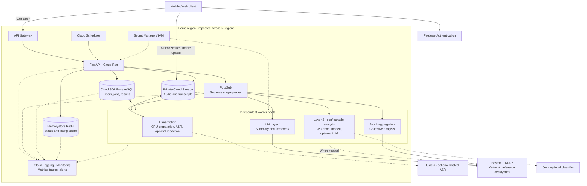

# Scalability architecture proposal

[Project overview](../README.md) · [POC infrastructure](../infra/README.md)

**Target:** N regions, each with 10,000 registered users and 2,000 concurrent users.

Proposed production architecture; the deployed POC runs on one Hetzner VM. Final choices depend on supported languages and dialects, privacy, residency, latency, cost, and measured quality.

## 1. Cloud provider and architecture

**Choose GCP** for managed compute, storage, queues, PostgreSQL, and access to hosted models through Vertex AI. Assign each user a home region and repeat the deployment across N regions. Confirm regional model availability; using one cloud does not guarantee inference locality or lower latency.

Use Cloud Run for the API, CPU tasks, and hosted API calls; add a Compute Engine inference pool if selected local models require it. PostgreSQL and object storage hold durable state; Redis is a small cache. Begin without database sharding and revisit it based on measured load.

Layer 2 remains configurable: CPU code for tasks such as RMS and simple counts, specialized models, or hosted LLMs. The POC functions illustrate possibilities; production requirements define the final set.

## 2. Triggers and processing

| Work | Trigger |
| --- | --- |
| Transcription, then Layer 1 | Verified upload completion |
| Layer 2 | User selection at upload or a later UI request |
| Collective analysis | Both on demand in the UI and scheduled, for example nightly |

The API returns a job ID and the UI polls for progress. Each completed stage queues the next. Scheduled aggregation processes changed collections only. Separate queue subscriptions allow independent scaling, with saved progress, duplicate protection, bounded retries, and a dead-letter queue.

## 3. Models and privacy

**Use hosted LLMs** for text analysis to access high quality models without operating a large inference fleet. Transcription is hosted when external audio processing is permitted, or self-hosted when raw audio must remain in our cloud. No ASR model is selected yet.

| Component | Proposed approach |
| --- | --- |
| Transcription | Test candidates such as [Whisper large-v3](https://huggingface.co/openai/whisper-large-v3), [Qwen3-ASR](https://huggingface.co/Qwen/Qwen3-ASR-1.7B), [Nemotron 3.5 ASR](https://huggingface.co/nvidia/nemotron-3.5-asr-streaming-0.6b), and [Parakeet TDT v3](https://huggingface.co/nvidia/parakeet-tdt-0.6b-v3) against required languages, accuracy, latency, and cost. |
| Hosted alternative | Prefer evaluating [Gladia Solaria](https://www.gladia.io/solaria) for simpler operations when privacy and residency requirements permit. |
| Optional CPU enhancement | Examples: [DeepFilterNet3](https://github.com/Rikorose/DeepFilterNet), [GTCRN](https://github.com/Xiaobin-Rong/gtcrn), or [UL-UNAS](https://github.com/Xiaobin-Rong/ul-unas). Preserve quiet and overlapping speech; residual music or noise is acceptable. Bypass if speech recall worsens. |
| Optional local redaction | Evaluate [OpenAI Privacy Filter](https://huggingface.co/openai/privacy-filter) plus credential checks before external LLM calls. Validate every supported language; its training is primarily English. Omit the local model where policy permits. |
| Text analysis | Candidates: [Claude Opus 5.5](https://www.anthropic.com/claude/opus) through Vertex AI or [GPT-6 Astra](https://developers.openai.com/api/docs/models/gpt-6-astra). Select by quality, region, latency, and cost. |

Use low effort for simple decisions, medium for summaries, and higher effort for complex synthesis, subject to evaluation and model support. [Jev](https://jev-ai.pro/use-cases) is an optional boolean/classification alternative; speed and quality must be tested.

Redaction does not guarantee removal of all sensitive content. If required filtering fails, block external calls. Keep storage private, enforce ownership, protect credentials, and exclude raw content from logs. Approve provider retention and processing locations before use. Models and services can be replaced as these requirements change.

## 4. Long audio and large file volumes

| Stage | Approach |
| --- | --- |
| Transcription | Split long audio near pauses with overlap and absolute timestamps. Process with bounded parallelism, retry failed chunks, then merge and remove overlap duplicates. Preserve quiet speech and reconcile speakers when diarization is used. |
| LLM context limits | Split transcripts at sentence or speaker boundaries by token budget, reserving space for instructions and output. Summarize chunks, merge bounded groups, and repeat until the file summary fits. Retain evidence references and conflicting findings. |
| Collective analysis | Filter one user's files by date, taxonomy, or analysis results. Page through stored file summaries and merge them in stages; never send the entire collection in one prompt. Reuse unchanged results and invalidate them when source files change or are deleted. |

Apply required redaction before external analysis. Compute numerical metrics from source data with overlap removed, and keep references to original passages for verification.

## 5. Scaling and reliability

Two thousand concurrent users do not imply two thousand simultaneous inference jobs. Size each region using upload rate, audio duration, completion targets, and provider quotas; validate with realistic load tests before rollout.

| Workload | Scaling basis |
| --- | --- |
| API | Request concurrency, latency, and database connection limits |
| CPU preparation and Layer 2 | Queue age, CPU, memory, and enabled analyses; isolate compute work from hosted calls |
| Local inference | Measured model throughput and CPU/GPU capacity |
| Hosted inference | Queue age and provider request/token quotas |
| Batch aggregation | Separate concurrency budget so it does not delay interactive jobs |

Cap work per user and total workers to control cost. Use database high availability and tested backups; fail over only to approved regions. Monitor queue age, failures, latency, resource usage, and cost per job. Test worker restarts and provider outages alongside load; POC resource measurements are not production capacity benchmarks.
