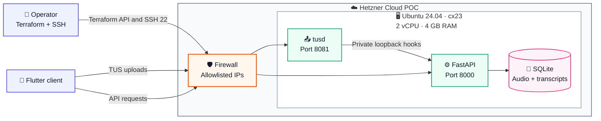

# Hetzner POC infrastructure

This Terraform deploys the POC to one Hetzner Cloud `cx23`: Ubuntu 24.04 x86_64, 2 shared vCPUs, 4 GB RAM, and 40 GB NVMe storage.



Terraform creates one SSH key entry, one restricted firewall, and one server. Cloud-init clones the selected Git ref, runs `backend/ubuntu_setup.sh`, and installs disabled systemd services. Runtime credentials are copied after provisioning and never enter Terraform state.

## Deploy

Requirements: Terraform 1.6+, a Hetzner Cloud Read & Write API token, and an SSH key pair.

```sh
export HCLOUD_TOKEN='replace-with-your-token'
cd infra
cp terraform.tfvars.example terraform.tfvars
```

In `terraform.tfvars`, replace the documentation CIDR with the operator and demo client's public `/32` address. Pin `repository_ref` to the demo commit.

```sh
terraform init
terraform fmt -check
terraform validate
terraform plan -out=poc.tfplan
terraform apply poc.tfplan
```

State, saved plans, and `terraform.tfvars` are local and ignored by Git.

## Install runtime credentials

Create a filled backend environment file outside Git. Set `GOOGLE_APPLICATION_CREDENTIALS=/opt/voice-analytics/backend/firebase-service-account.json` and retain the service values from `backend/.env.example`.

```sh
SERVER_IP="$(terraform output -raw public_ip)"
ssh "root@$SERVER_IP" 'cloud-init status --wait'
scp /secure/path/backend.env "root@$SERVER_IP:/root/backend.env"
scp /secure/path/firebase-service-account.json "root@$SERVER_IP:/root/firebase-service-account.json"
ssh "root@$SERVER_IP" \
  'install -o voiceai -g voiceai -m 0600 /root/backend.env /opt/voice-analytics/backend/.env && install -o voiceai -g voiceai -m 0600 /root/firebase-service-account.json /opt/voice-analytics/backend/firebase-service-account.json && rm -f /root/backend.env /root/firebase-service-account.json && systemctl enable --now voice-analytics-api.service voice-analytics-tusd.service'
```

## Verify or destroy

```sh
curl "$(terraform output -raw api_url)/health"
ssh "root@$(terraform output -raw public_ip)" \
  'systemctl --no-pager status voice-analytics-api.service voice-analytics-tusd.service'
```

The POC uses HTTP and restricts access through `application_source_ranges`. Destroying the server also destroys its local data.

```sh
terraform destroy
```
